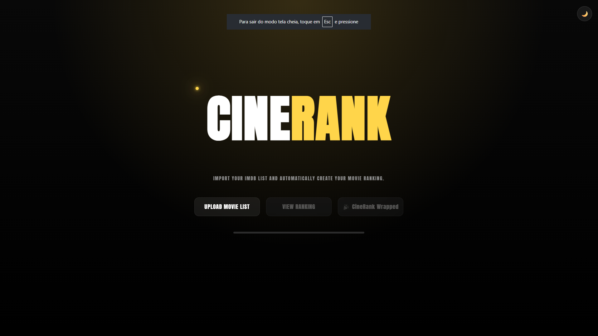

# 🎬 CineRank

Eu sempre tive uma lista enorme de filmes no IMDb e queria uma maneira mais interessante de visualizar tudo que havia nela. Foi daí que surgiu a ideia do **CineRank**.
O CineRank é um projeto que criei para organizar e visualizar minha lista de filmes do IMDb de uma forma mais bonita e prática.
A ideia foi transformar aquela lista de filmes em algo mais interessante de explorar, com ranking, estatísticas, avaliações e informações sobre cada filme, algo que te recomende a proxima serie ou filme a assistir ao inves de ficar procurando.

## 📸 Preview



## ✨ O que dá para fazer

- 📂 Importar biblioteca de filmes através de um CSV do IMDb
- 🏆 Ver os filmes organizados em um ranking
- 🔎 Pesquisar filmes pelo nome
- 🎭 Filtrar filmes por gênero
- ❤️ Adicionar filmes aos favoritos
- 🎬 Ver informações detalhadas de cada filme
- ▶️ Assistir aos trailers disponíveis
- ⭐ Ver minhas avaliações
- 📊 Explorar estatísticas da minha biblioteca
- 📈 Visualizar gráficos sobre os filmes
- 🌗 Alternar entre tema claro e escuro
- 📱 Usar o site pelo celular, tablet ou computador
- 🎁 Gerar o CineRank Wrapped em PDF
- 🔗 Compartilhar o Wrapped

## 🛠️ Tecnologias que usei

- HTML5
- CSS3
- JavaScript
- PapaParse
- Chart.js
- TMDB API

O projeto foi desenvolvido principalmente para praticar JavaScript, manipulação do DOM, consumo de APIs, leitura de arquivos e organização de dados.

## 🎬 Como funciona

1 - Primeiro, o usuário exporta sua biblioteca de filmes do IMDb em formato CSV.
2 - Depois é só importar o arquivo no CineRank.
3 - A aplicação lê os dados e monta a biblioteca automaticamente, permitindo pesquisar, filtrar e organizar os filmes.

- Além dos dados do IMDb, utilizo a API do TMDB para buscar informações extras, como:

- Pôsteres
- Imagens
- Sinopse
- Elenco
- Trailers
- Outras informações sobre os filmes

## 🏆 Ranking

Os filmes importados são organizados em um ranking para facilitar a visualização da biblioteca.
Também é possível pesquisar e filtrar os filmes para encontrar rapidamente o que estou procurando.


## ⭐ Minhas avaliações

O CineRank também possui uma área dedicada aos filmes que já foram avaliados.
Nela é possível visualizar os filmes avaliados, seus respectivos cartazes, notas e informações relacionadas à avaliação.


## ❤️ Favoritos

Também criei um sistema de favoritos para poder marcar os filmes que mais gostei e encontrá-los com mais facilidade.

## 🎬 Detalhes dos filmes

Ao selecionar um filme, é possível abrir uma tela com informações mais detalhadas, incluindo dados obtidos através da API do TMDB.


## 📊 Dashboard

Uma das partes que mais gostei de desenvolver foi o dashboard.
Ele reúne estatísticas e gráficos sobre a biblioteca de filmes, permitindo visualizar os dados de uma forma mais fácil de entender.


## 🎁 CineRank Wrapped

O projeto também possui uma experiência de **CineRank Wrapped**, inspirada em retrospectivas como o Spotify Wrapped.
A ideia é mostrar um resumo da biblioteca de filmes de uma forma mais visual e divertida.
Também é possível gerar o Wrapped em PDF e compartilhar o resultado.


## 🌗 Tema

O CineRank possui dois temas:

- 🌙 Dark Mode
- ☀️ Light Mode


Tentei manter a mesma identidade visual nos dois temas, principalmente utilizando o dourado como cor de destaque.

## 📱 Responsividade

O site foi desenvolvido pensando também em telas menores.

Ele funciona em:

- 💻 Computadores
- 💻 Notebooks
- 📱 Celulares
- 📱 Tablets

Durante o desenvolvimento também fiz vários ajustes de responsividade para evitar problemas de layout em telas diferentes.


## 🚀 Como rodar o projeto

Clone o repositório:

```bash
git clone [https://github.com/SEU-USUARIO/CineRank.git]
```

Entre na pasta:

```bash
cd CineRank
```

Depois abra o projeto utilizando o **Live Server** ou outro servidor local.
Como o projeto utiliza APIs externas, algumas funcionalidades precisam de conexão com a internet.

## 🔑 TMDB API

O CineRank utiliza a API do TMDB para complementar os dados importados do IMDb.
A API é utilizada para buscar informações como pôsteres, imagens, sinopse, elenco e trailers.
Em uma aplicação de produção, o ideal seria utilizar um backend ou proxy para proteger as credenciais da API.

> Este projeto não é afiliado, endossado ou patrocinado pelo IMDb ou pelo TMDB.

## 📚 O que aprendi fazendo esse projeto

Esse foi um dos projetos em que mais consegui colocar em prática o que venho estudando.
Durante o desenvolvimento trabalhei bastante com:

- JavaScript
- Manipulação do DOM
- Arrays e objetos
- `fetch()` e consumo de APIs
- Programação assíncrona
- Leitura e processamento de arquivos CSV
- Filtros e ordenação de dados
- Eventos
- Flexbox
- CSS Grid
- Responsividade
- Animações
- Gráficos
- Tratamento de erros

Também tive bastante contato com problemas que aparecem durante o desenvolvimento de um projeto real, como dados faltando, respostas diferentes de APIs, imagens que não carregam e problemas de responsividade.

## 🔮 Ideias para o futuro

O CineRank ainda pode crescer bastante. Algumas ideias que pretendo explorar em versões futuras:

- Sistema de login e cadastro
- Backend
- Banco de dados
- Perfis de usuários
- Listas personalizadas
- Sistema de recomendações
- Sincronização das avaliações
- Compartilhamento de bibliotecas
- Mais opções de estatísticas

Por enquanto, considero essa a primeira versão do CineRank.

## 👨‍💻 Sobre mim

Eu sou **Júlio Marinho** e estou estudando Ciência da Computação, com foco em desenvolvimento web.
O CineRank faz parte dos projetos que estou desenvolvendo para colocar em prática o que venho aprendendo e construir meu portfólio.

## 📄 Licença

Projeto desenvolvido para fins de estudo e portfólio.
